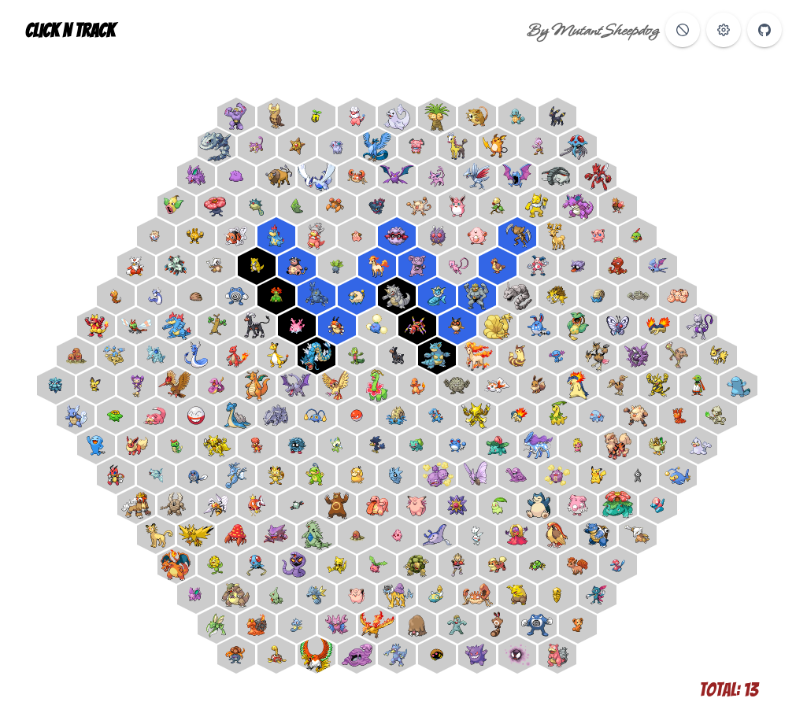
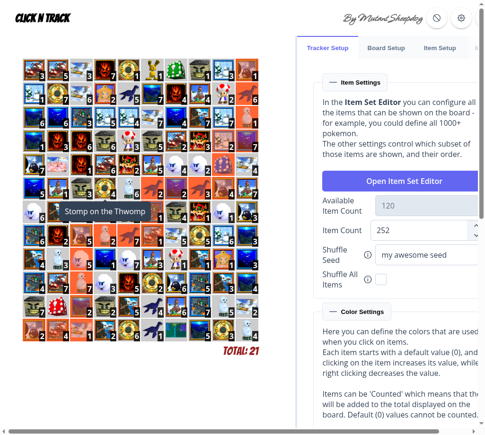
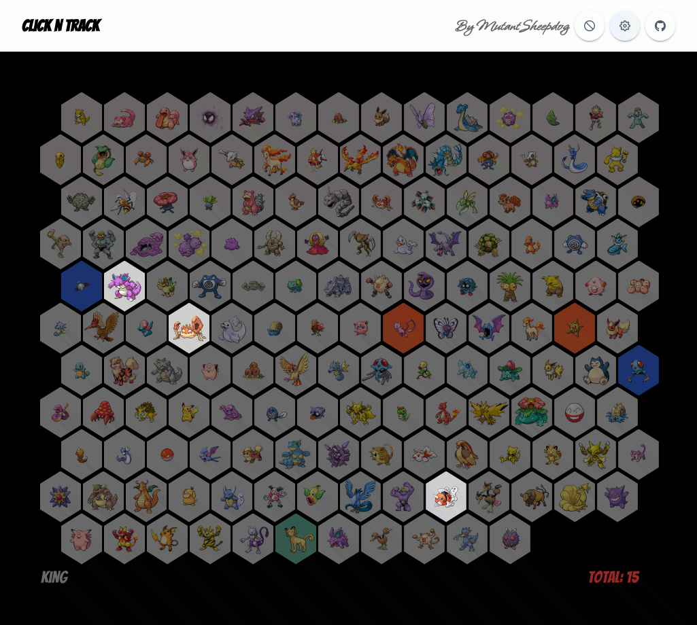
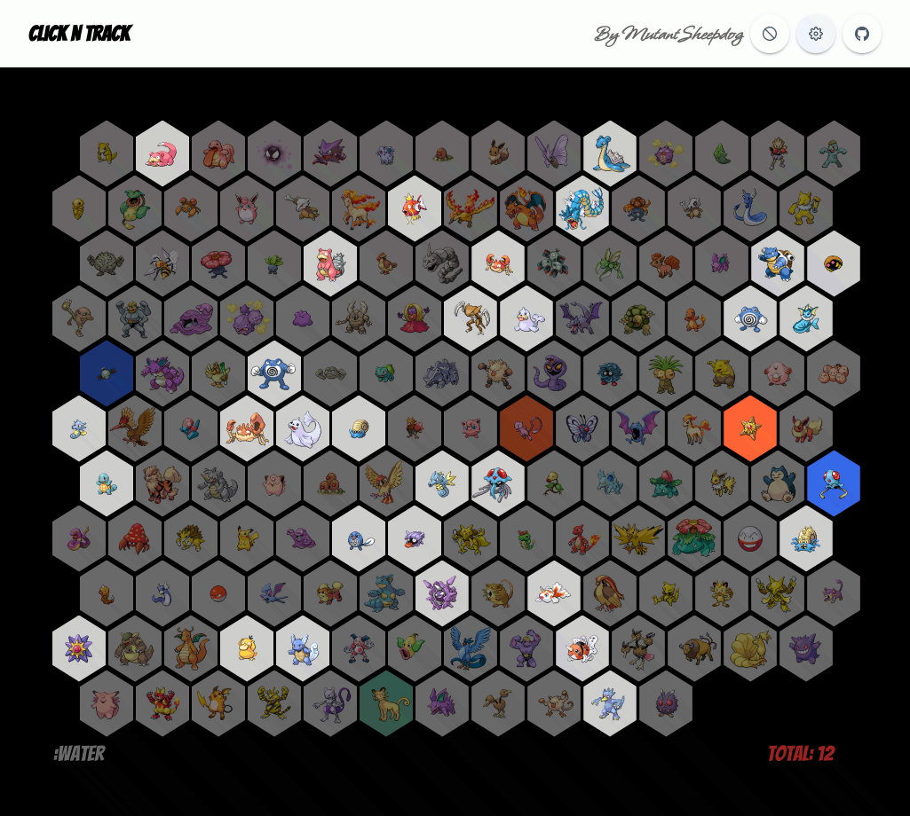
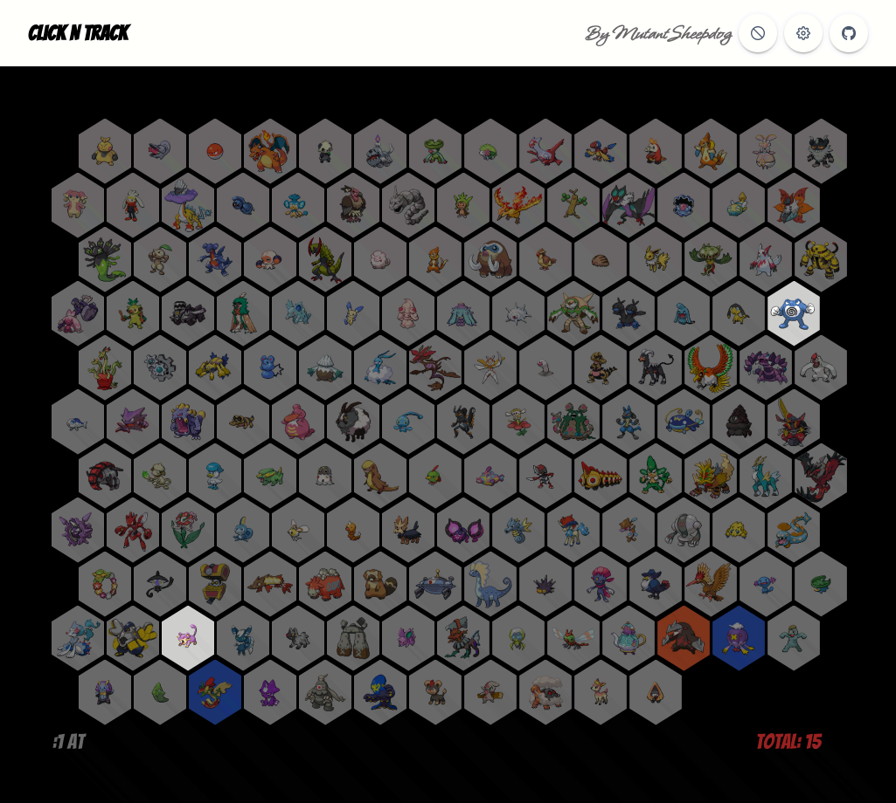
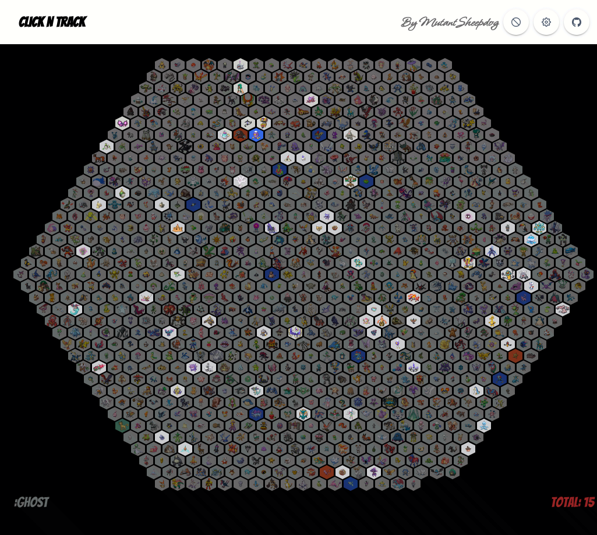

# Click N Track

This is an application for tracking goals while playing goals.

I designed this primarily for use by streamers doing various challenges and races, and is made to be customisable to suit your needs.

## Quick Start
Click N Track is a single web page that can be run from a local file. No server needed.
1. Download the ZIP in the latest [release](https://github.com/BlakeTheAwesome/clickntrack/releases)
2. Extract the ZIP to a folder
3. Open the `index.html` file in your preferred browser

## Features

### Customisation

You can customise all the following aspects of the board:
- Item shape (square or hexagon)
- Board shape (square or hexagon)
- Board width (for square boards)
- Item sizes
- Whether or not text is overlaid (such as numbers on SM64 stars)
- Colours

You can also totally customise what items are on the board, and what they look like. JSON files are used to define the item sets, and you can use the provided presets or add your own.

For more information on customising the items, please check the [Item Editor Guide](./docs/item_editor.md).

### Tracking

You can track items by clicking on them.
Left clicking increases the value, right clicking decreases the value.

By default 0 is grey, positive numbers are different colours, and -1 is black. You can of course, customise these colours and values.

### Filtering

By typing on the keyboard you can filter the board to show the matching items.

Keyword searches can also be done by prefixing your search with `:`. In the pokemon preset, all pokemon types and generations are added as keywords, so you can search for `:fire` to show all fire types, or `:gen1` to show all gen 1 pokemon.

Additionally, you can apply multiple filters by adding spaces between them. For example, `:fire :gen1 a` will show all gen 1 fire types with an 'a' in their name.

This can be very useful when you have a large board!

### Settings
The settings panel can be shown/hidden by clicking the gear icon in the top right. In this panel you can customise how the board is displayed, as well as which items are shown.
A brief run down of the settings sections:

#### Tracker Setup
This tab is divided into two sections: Item Settings, and Color Settings.
- **Item settings** is where you will find the 'Item Set Editor' which allows you to pick all the available spaces on the board. It also includes options for how many of those items to load, and a random seed for shuffling the items.
- **Color settings** is where you can change the colours used for different item values. The 0 value is the default colour, positive values are for left-clicks, and negative values are for right-clicks.

#### Board Setup
This is where you can change the display of the board, allowing you to switch between square and hexagon shapes, and modify the colours used for the search and totals text.

#### Item Setup
This is where you can modify how each item on the board is displayed. They can be shown as images, text, or both. Additionally you can mark items using middle click, and customise the display for that here.

Most of the settings should be self-explanatory, but I'd recommend just trying them out to get a feel for how they work!

#### Import / Export

You can save your current settings to a JSON file and load them again later. This is useful for backing up your configuration, sharing a setup with others, or switching between different presets.

**Exporting** — choose which sections to include: board layout, item display, click colours, item selection, and the full item set. You can give the export a name to help identify it later.

**Importing** — select a previously exported file. You can choose which sections to apply, so you can bring in just the item set without touching your colour configuration, for example. Imported files are validated before being applied.

### Saving / Loading

Your current state is saved in your browser's local storage, so you can close the page and come back to it later.

If the app encounters an error loading your saved data (for example after a settings format change), it will display a recovery screen. From there you can download a backup of your current data before clearing it, or clear and reload immediately.

## Development

If you want to know more about building this application, or contributing to the project, please check out the [development guide](./docs/development.md).