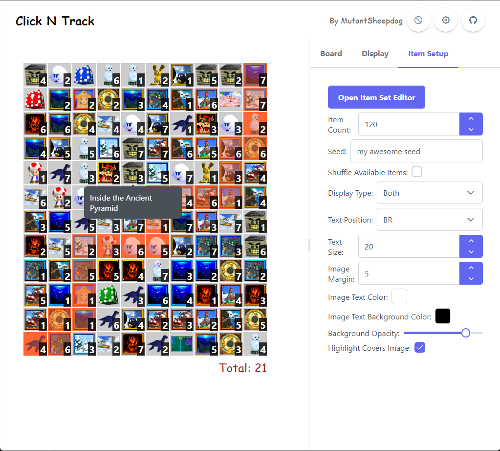

# Click N Track

This is an application for tracking goals while playing goals.

I designed this primarily for use by streamers doing various challenges and races, and is made to be customisable to suit your needs.

Note this is an early release, so some of the settings menus are a bit rough. I plan to clean these up over time.

## Quick Start
Click N Track is a single web page that can be run from a local file. No server needed.
1. Download the ZIP in the latest [release](https://github.com/BlakeTheAwesome/clickntrack/releases)
2. Extract the ZIP to a folder
3. Open the `index.html` file in your preferred browser

## Features

### Customisation

You can customise all the following aspects of the board:
- Item shape (square or hexagon)
- Board shape (square or hexagon)
- Board width (for square boards)
- Item sizes
- Whether or not text is overlaid (such as numbers on SM64 stars)
- Colours

You can also totally customise what items are on the board, and what they look like. JSON files are used to define the item sets, and you can use the provided presets or add your own.

For more information on customising the items, please check the [Item Editor Guide](./docs/item_editor.md).

### Tracking

You can track items by clicking on them.
Left clicking increases the value, right clicking decreases the value.

By default 0 is grey, positive numbers are different colours, and -1 is black. You can of course, customise these colours and values.

### Filtering

By typing on the keyboard you can filter the board to show the matching items.

Keyword searches can also be done by prefixing your search with `:`. In the pokemon preset, all pokemon types and generations are added as keywords, so you can search for `:fire` to show all fire types, or `:gen1` to show all gen 1 pokemon.

Additionally, you can apply multiple filters by adding spaces between them. For example, `:fire :gen1` will show all gen 1 fire types.

This can be very useful when you have a large board!

### Saving / Loading

Your current state is saved in your browser's local storage, so you can close the page and come back to it later.

## Development

If you want to know more about building this application, or contributing to the project, please check out the [development guide](./docs/development.md).