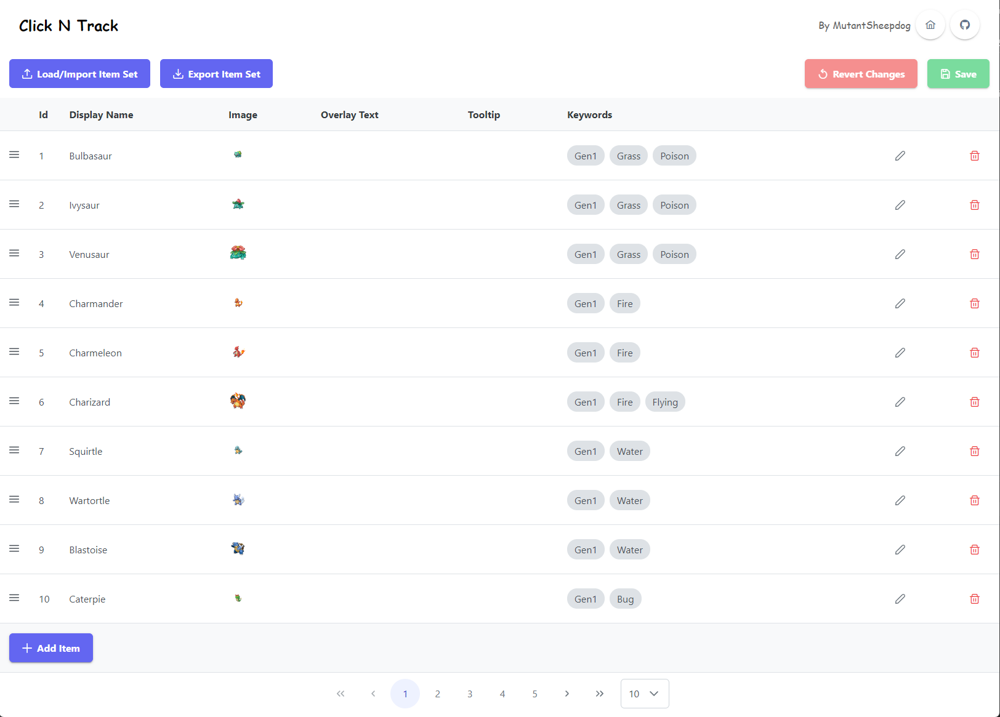
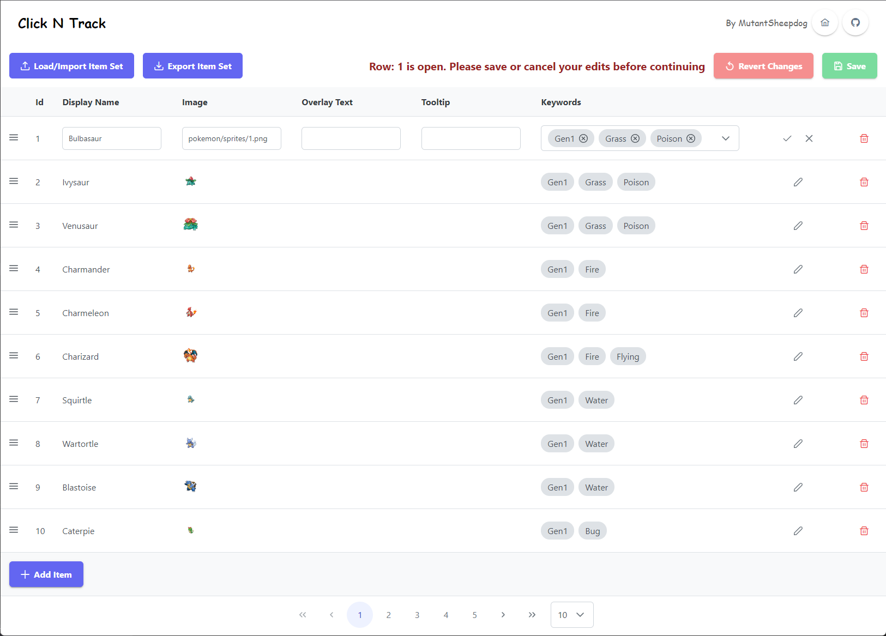
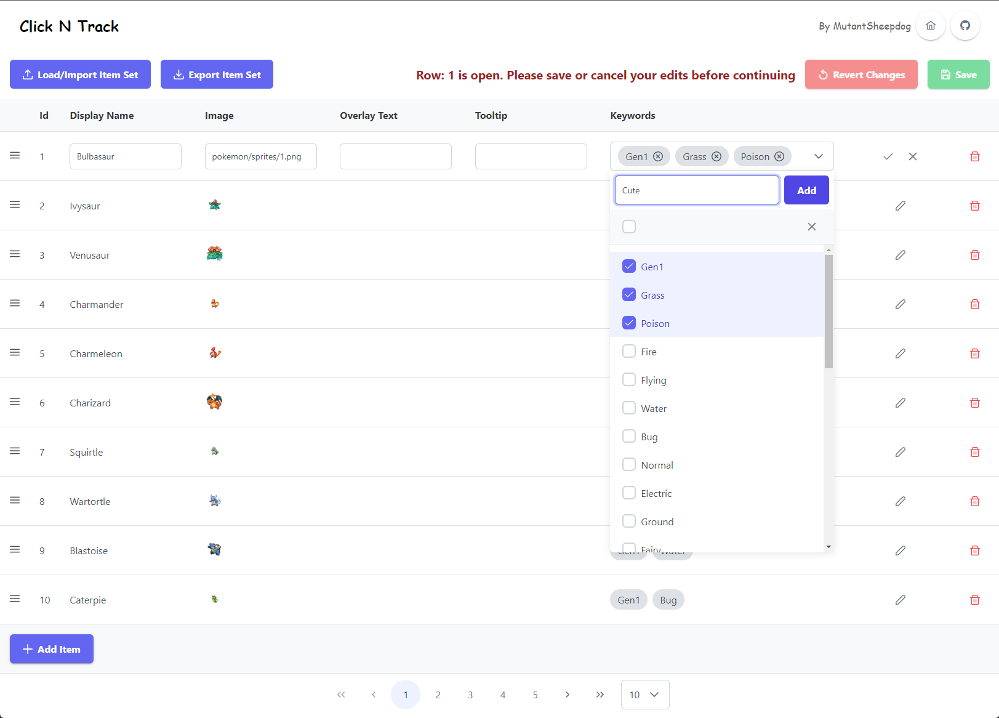
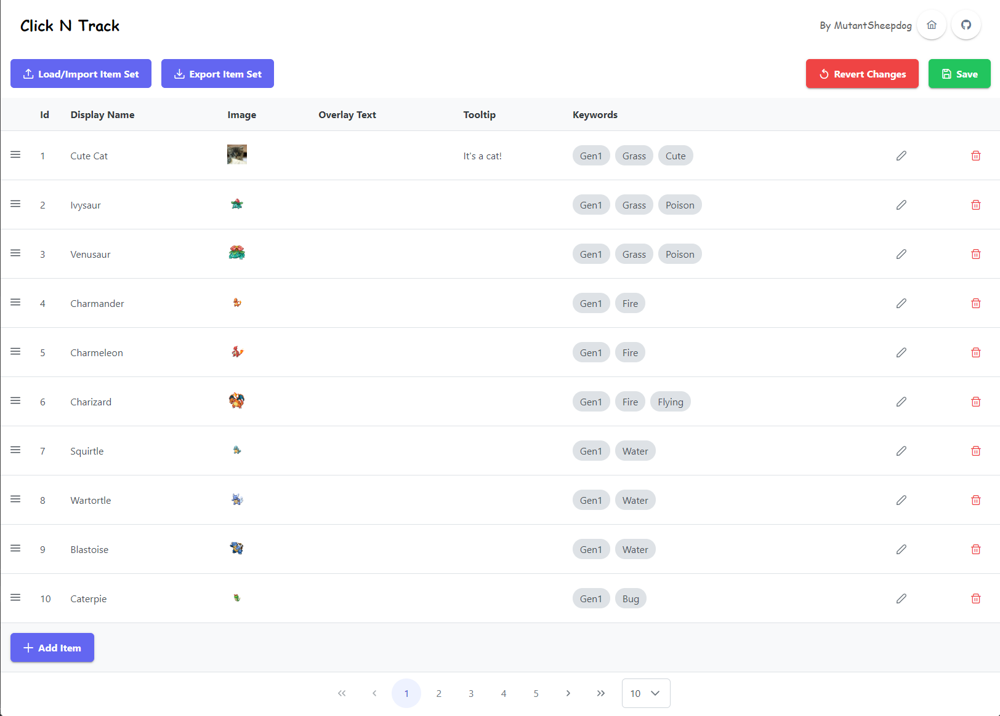
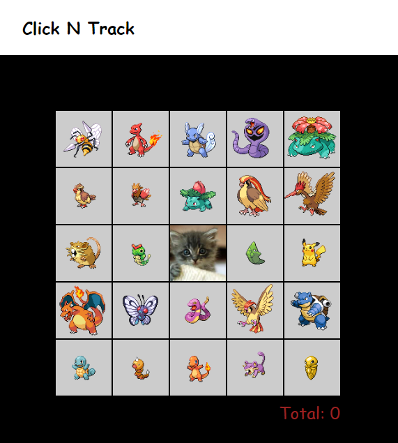
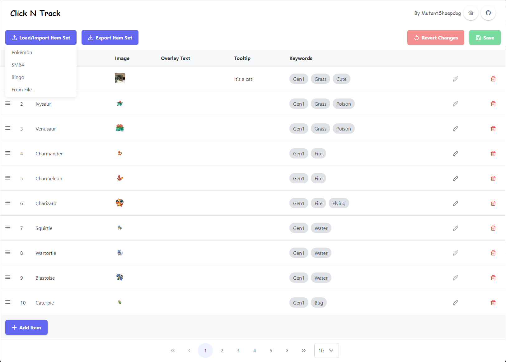

# Click N Track Item Editor

The item editor in Click N Track is designed to help you create custom item sets. Advanced users may find it easier to edit the JSON data directly, so import/export buttons are provided.

The JSON file format is described at the bottom of this document.

## Usage
To access the item editor, open the settings panel on the main page, then click `Item Setup`, and click the `Open Item Set Editor` button.

This will take you to a separate page which you can use to customise your item set.




### Modifying an item
Clicking the pencil icon, allows you to modify a row.



To modify the keywords, click on the dropdown, and select the keywords from the list.
The keywords shown will be all the keywords currently in use. A new one can be added in the top of the dropdown area (see `Cute` in the example below)



The images can either be a path relative to the `index.html` (for example the pokemon sprites are all provided in the `pokemon/sprites` subdirectory), or they can be a URL elsewhere. For example, a placeholder cat from https://placekitten.com/200/200.


Be sure to click the tick icon when you are done editing a row.



After saving your changes, you can return to the home page to see the updated item set.




### Loading an existing item set
To load an item set, click the `Load/Import Item Set` button, and select the preset you want to load.
A few presets are provided, but you can also load another JSON file if you have one.




## JSON File Format
When you export an item set, it will be saved as a JSON file. You can edit this file directly, and load it back into the item editor.

The format of the JSON file is an array of items matching this TypeScript definition:
```ts
export type TrackerItem = {
  id: number
  displayName: string
  keywords?: string[]
  img?: string
  overlayText?: string
  tooltip?: string
}
```

The fields are as follows:
- `id` - A unique ID for the item. This is used to track the item, so it must be unique. If using the editor, these will be automatically assigned
- `displayName`: The name of the item.
  - This is used when filtering the items, and is also used as the default for tooltips and overlay text.
- `keywords`: An optional list of keywords.
  - These are used when filtering the items.
  - To filter based on keywords, prefix your search with `:`, for example `:fire` will show all items with the `fire` keyword.
- `img`: An optional path to the image to use for the item.
  - This image will be shown in the tracker if the `Display Type` setting is set to `Image` or `Both`
  - This can be a relative path, or a URL.
- `overlayText`: An optional string to overlay on the image.
  - This will be shown in the tracker if the `Display Type` setting is set to `Text` or `Both`
  - This is useful for things like SM64 stars, where you want to overlay the start number inside the level
- `tooltip`: An optional tooltip to show when hovering over the item.
  - If not provided, the `displayName` will be used instead
